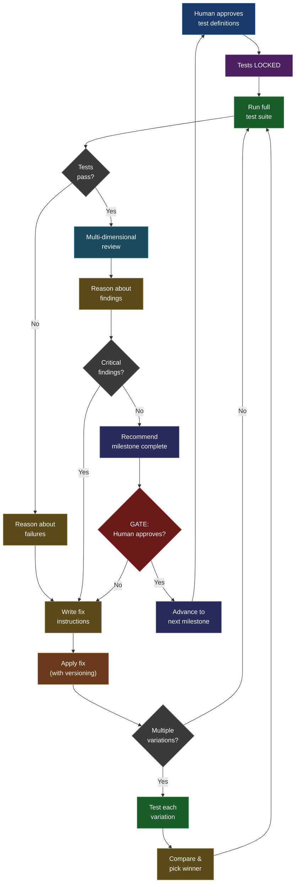

# The Iteration Algorithm

The core development cycle follows a tight loop: **test, reason, fix, re-test, review, decide**. Each cycle targets a single milestone — a defined capability the skill must demonstrate. The loop repeats until the skill is good enough to advance.

---

## The 9-Step Cycle

1. **Lock the tests.** A human reviews and approves the test definitions for the current milestone. After approval, tests are immutable — no agent may modify them. If an agent believes a test is wrong, it must stop and escalate. This constraint forces all improvement to happen in the skill, not by softening the bar.

2. **Run the full test suite.** A dedicated test-runner agent executes every test and writes structured results (pass/fail per assertion, grouped by category). Results are written to files, not returned in prompts — every agent downstream reads the same artifact.

3. **If tests fail: reason about failures.** A reasoning agent reads the raw results and performs root-cause analysis. It examines the skill's source files, compares the current version against previous versions, and identifies why each failure occurred. It then writes a decision document that classifies the failure (correctness bug, robustness gap, token waste) and produces fix instructions — a precise description of what to change and why.

4. **Apply the fix with versioning.** A skill-change agent reads the fix instructions, backs up the current skill state, and applies the change. When a fix is uncertain, it can produce multiple variations (e.g., V6.1, V6.2, V6.3) rather than committing to one approach. Each variation is tested independently.

5. **Compare and pick the winner.** If multiple variations were tried, a comparator agent evaluates results across all versions and selects the best one — or reverts to the pre-change baseline if all variations regressed. The winning version becomes the new baseline. Return to step 2.

6. **If tests pass: run a multi-dimensional review.** Passing tests is necessary but not sufficient. A review act spawns independent reviewers across multiple quality dimensions (e.g., 6-10 dimensions covering structural clarity, single-source-of-truth adherence, token efficiency, extensibility, and others). Each reviewer scores their dimension independently. A synthesis agent combines findings into a scorecard and verdict.

7. **Reason about review findings.** The reasoning agent reads the review scorecard and applies delta acceptance rules to each finding. Correctness issues are always fixed. Token savings are only worth pursuing if they exceed a meaningful threshold (e.g., 10%). Robustness issues are fixed only if they cause hard failures on valid input. Everything else is skipped — small improvements that are not correctness-related are not worth the churn risk.

8. **If critical findings remain: fix and re-test.** Apply the fix, return to step 2.

9. **If no critical findings remain: milestone complete.** The system recommends progression, but only the human approves it. This is a hard gate — no agent can bypass it. On approval, the skill state is backed up as the new baseline, relevant tests are promoted to the next milestone, and the cycle begins again with new test definitions.

The algorithm has a built-in circuit breaker: if a fix fails three times, the system stops and escalates rather than burning iterations. Asking a human is cheap; wasting cycles is expensive.

---

## Flow Diagram

<b>Iteration cycle flowchart</b>

---

## Key Concepts

### Versioned improvements

Rather than committing to a single fix and hoping it works, the system can explore multiple variations in parallel. When addressing a failure, the skill-change agent produces up to three sub-versions (e.g., V6.1, V6.2, V6.3), each attempting a different approach to the same problem. Every variation is tested against the full suite, and a comparator agent evaluates results across all versions. The best-performing variation is promoted to the new baseline. If all variations regress, the system reverts to the pre-change state — no fix is better than a bad fix. A version log records every change, its rationale, and its test outcome, creating a complete audit trail of the skill's evolution.

### Immutable tests

Once a human approves test definitions for a milestone, those tests are locked. No agent — regardless of its role or reasoning — may modify test files. This is a hard constraint, not a guideline. If an agent believes a test is wrong, it must stop execution and escalate to a human. This inversion is deliberate: the skill adapts to the tests, never the other way around. Immutable tests prevent a subtle failure mode where agents gradually weaken assertions to make the skill "pass" without actually improving it. The tests represent the contract; the skill must fulfill it.

### Automated reasoning

A dedicated reasoning agent sits between every phase transition in the cycle. After test failures, it performs root-cause analysis by comparing the current skill version against previous versions, tracing execution logs, and identifying exactly which change caused the regression. After reviews, it applies structured acceptance rules to each finding and decides what is worth fixing. The reasoning agent writes its analysis to decision documents — structured files that record the evidence examined, the analysis performed, the delta assessment, and the resulting verdict. These documents are the institutional memory of the development process: they capture not just what was decided, but why.

### Multi-dimensional review

Passing all tests proves the skill produces correct output, but it says nothing about code quality, maintainability, or efficiency. After tests pass, the system runs a review across multiple independent scoring dimensions — structural clarity, single-source-of-truth adherence, token efficiency, robustness, restriction handling, extensibility, and others. Each dimension is scored by an independent reviewer agent who examines the skill through that single lens. A protocol verifier checks that inter-agent communication contracts are consistent. A synthesis agent combines all findings into a scorecard and a verdict. This multi-lens approach catches issues that no single reviewer would notice: a structurally clean skill might still violate SSOT principles, or a correct skill might waste tokens through redundant instructions.

### Delta acceptance rules

Not every finding is worth fixing. The reasoning agent applies explicit thresholds to decide what crosses the bar: correctness issues (any delta, no matter how small) are always fixed. Token savings must exceed a meaningful threshold (e.g., 10%) to justify the churn risk — smaller improvements are noise. Robustness issues are fixed only if they cause hard failures on valid input; soft degradation is tolerable. Everything else is skipped unless it blocks milestone progression. This discipline prevents a common trap in iterative development: endlessly polishing minor issues while introducing new bugs through unnecessary changes. The key principle is that the risk of introducing regressions outweighs marginal gains. Late iterations raise the bar even higher — in a final iteration, only correctness fixes are accepted.

---

## Example Walkthrough

Consider a skill that orchestrates a two-phase workflow: Phase 1 generates data, Phase 2 consumes it. After a refactoring pass (V7) that simplified the skill's entry-point file, most tests pass — except a multi-phase test that requires the orchestrator to loop through phases. The test runner reports roughly half the assertions passing. The reasoning agent analyzes the failure and identifies that the refactoring replaced an imperative instruction ("Loop: prepare phase, spawn agent, receive result, next") with a passive description ("The skill plans work into phases, then executes each phase sequentially"). The root cause: LLM agents follow imperatives but treat descriptions as documentation. The reasoning agent writes fix instructions: restore imperative sentences without reintroducing the duplication the refactoring was meant to eliminate. The skill-change agent backs up V7, applies the fix as V8, and the test runner re-runs all tests — all pass. The review then surfaces a categorization error in a type-specific file. The reasoning agent classifies it as a correctness finding (always fix), applies it, and the final review clears with no critical findings. The human approves milestone progression.

| Step | Action | Outcome |
|------|--------|---------|
| Run 1 | Test V7 | ~50% of assertions pass (FAIL) |
| Reason | Root-cause: imperative instruction removed | Fix instructions written |
| Run 2 | Test V8 (fix applied) | All assertions pass |
| Review | Multi-dimensional review | Moderate score, 1 correctness finding |
| Reason | Delta rules: correctness = always fix | Fix instructions written |
| Run 3 | Test V9 (fix applied) | All assertions pass |
| Review | Final review | No critical findings |
| Gate | Human approves | Advance to next milestone |

---

## How This Connects to the Scaffold

Each algorithm step maps to specific files and folders in the scaffold. Use this table to navigate from concept to implementation.

| Algorithm Step | Scaffold Location | What's There |
|---|---|---|
| 1. Lock the tests | `implementation/m1-example/tests/` | Test blueprints (`blueprint.md`) and assertions (`asserts.md`) per test case |
| 2. Run test suite | `roles/act-test-runner/` | Runner (`runner.md`), orchestrator (`orchestrator.md`), verifier (`verifier.md`), reporter (`reporter.md`) |
| 3. Reason about failures | `roles/act-reasoning/reasoner.md` | Root-cause analysis role with structured decision-document output |
| 4. Apply fix | `roles/act-skill-change/` | Skill-change agent (`skill-change.md`) and backup agent (`backup.md`) |
| 5. Compare variations | `roles/act-reasoning/comparator.md` | Version comparison role — evaluates multiple fix variations against test results |
| 6. Multi-dimensional review | `roles/act-review/` + `skill-review/` | Dimension reviewers, protocol verifier, synthesis agent, checklists (`skill-review/resources/`), and scoring criteria |
| 7. Reason about findings | `roles/act-reasoning/reasoner.md` | Delta acceptance analysis — same reasoner role, applied to review findings instead of test failures |
| 8. Fix and re-test | `roles/act-skill-change/` | Same skill-change and backup agents; cycle returns to step 2 |
| 9. Milestone complete | `decisions/` | Decision documents recording the evidence, analysis, and verdict for each iteration |

Test results from each run are written to `implementation/m1-example/results/` — structured files that every downstream agent reads from the same source of truth.
