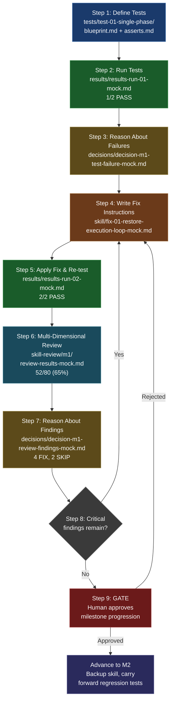

# Walkthrough: One Complete Iteration Cycle

This walkthrough traces one full M1 iteration cycle through the scaffold's mock files. Each step references the specific artifact that step produces, so you can follow the data flow from test definition through milestone completion. The mock files use realistic content — the same formats your own runs will produce.

---

## Step 1: Define and Lock Tests

The cycle begins with test definitions. Each test case has two files: a **blueprint** describing the scenario and expected behavior, and an **asserts** file listing the concrete pass/fail checks.

**Mock files:**

- [`implementation/m1-example/tests/test-01-single-phase/blueprint.md`](../implementation/m1-example/tests/test-01-single-phase/blueprint.md) — defines a single-phase task: invoke the skill, plan one phase, spawn an agent, produce output.
- [`implementation/m1-example/tests/test-01-single-phase/asserts.md`](../implementation/m1-example/tests/test-01-single-phase/asserts.md) — 13 assertions across three categories: structural (output shape), functional (correct behavior), and log (execution flow).

The Director (human) reviews and approves these definitions. After approval, **tests are locked** — no agent may modify them for the remainder of this milestone. If an agent believes a test is wrong, it must escalate rather than edit. This constraint forces all improvement into the skill itself.

---

## Step 2: Run Tests (Run 01 — Failure)

The test-runner act executes the full suite against the current skill version and writes structured results.

**Mock file:** [`implementation/m1-example/results/results-run-01-mock.md`](../implementation/m1-example/results/results-run-01-mock.md)

**What happened:**

- **test-01 (single-phase): PASS** — 24/24 assertions. Planning, execution, and output all work correctly for a one-phase task.
- **test-02 (multi-phase): FAIL** — 14/28 assertions. The orchestrator completes planning but never enters the phase execution loop. Phases 2 and 3 never run — their output files do not exist.

The results file captures a key observation:

> The orchestrator instructions use passive language ("phases should be executed sequentially") instead of imperative ("execute phases sequentially"). Single-phase tests succeed because the orchestrator treats a 1-phase plan as a single action, but multi-phase requires explicit loop dispatch.

The results summary table tracks progression across runs:

**Mock file:** [`implementation/m1-example/results/results-summary.md`](../implementation/m1-example/results/results-summary.md) — running ledger showing run-01 at 1/2 tests, 238k total tokens.

---

## Step 3: Reason About Failures

The Reasoner reads the raw test results, examines the skill source, and performs root-cause analysis. It writes a structured decision document.

**Mock file:** [`decisions/decision-m1-test-failure-mock.md`](../decisions/decision-m1-test-failure-mock.md)

**Analysis summary:**

- **Root cause identified:** The skill's entry point describes the execution flow in passive language — a description, not an instruction. The executing agent reads it as documentation rather than a directive. A previous version had an explicit imperative ("Loop: prepare phase, spawn agent, receive result, report, next"), but it was removed during a deduplication pass that mistook a behavioral instruction for redundant documentation.
- **Critical distinction:** LLM agents follow imperatives. They read descriptions as documentation. Removing the imperative broke the execution loop.
- **Decision:** Fix — restore imperative execution loop instruction without reintroducing the full duplicated algorithm.

The decision document applies delta assessment rules: this is a correctness regression (any delta = always fix).

---

## Step 4: Write Fix Instructions

The Reasoner produces precise fix instructions that tell the skill-change agent exactly what to modify.

**Mock file:** [`skill/fix-01-restore-execution-loop-mock.md`](../skill/fix-01-restore-execution-loop-mock.md)

**Contents:**

- **Problem statement** with evidence link back to the decision document
- **Root cause explanation** distinguishing behavioral instructions from procedural documentation
- **Before/after text** — the exact passive description to replace and the imperative replacement
- **Acceptance criteria:** the entry point contains an imperative loop instruction, it does not restate the full algorithm, both tests pass
- **Priority:** Correctness
- **Expected delta:** test-02 goes from FAIL to PASS, test-01 unaffected

---

## Step 5: Apply Fix and Re-test (Run 02 — Success)

The skill-change act ([`roles/act-skill-change/`](../roles/act-skill-change/)) reads the fix instructions, backs up the current skill version, and applies the change. Then the test-runner act re-executes the full suite.

**Mock file:** [`implementation/m1-example/results/results-run-02-mock.md`](../implementation/m1-example/results/results-run-02-mock.md)

**What happened:**

- **test-01 (single-phase): PASS** — no regression. Token usage slightly lower (56k vs 58k).
- **test-02 (multi-phase): PASS** — all 28 assertions pass. The multi-phase execution loop works correctly. All 3 phases execute sequentially with correct I/O handoffs.
- **Token efficiency improved slightly:** total tokens dropped from 238k to 226k (-5%). The orchestrator spends fewer tokens reasoning about next steps now that instructions are imperative.

All tests pass. The cycle advances to review.

---

## Step 6: Run Multi-Dimensional Review

Passing tests proves correctness but says nothing about code quality, maintainability, or efficiency. The review act spawns independent reviewers across 8 quality dimensions. Each reviewer scores their dimension against a concrete checklist.

**Mock files:**

- [`skill-review/m1/checklist-m1-mock.md`](../skill-review/m1/checklist-m1-mock.md) — the review checklist: 23 concrete pass/fail items across 8 dimensions (D1 Structural Clarity through D8 Extensibility). Each item gets a PASS, FAIL, or PARTIAL verdict.
- [`skill-review/m1/d2-ssot-review-mock.md`](../skill-review/m1/d2-ssot-review-mock.md) — D2 (Single Source of Truth) scored 5/10. Found execution flow duplicated between two files and error handling fragmented across three files.
- [`skill-review/m1/d7-restrictions-review-mock.md`](../skill-review/m1/d7-restrictions-review-mock.md) — D7 (Restriction Consistency) scored 6/10. Two restrictions defined in the phase-type spec are absent from the agent spec, leaving agents with incomplete boundaries.
- [`skill-review/m1/review-results-mock.md`](../skill-review/m1/review-results-mock.md) — the synthesized scorecard: **52/80 (65%)**, verdict **"Ready with caveats."** Lists 3 priority fixes (all correctness category) and 3 skipped findings (below threshold).

The review surfaces issues invisible to tests alone: SSOT violations that guarantee drift, restriction gaps that leave agents under-constrained, and a protocol gap where an error response has no documented consumer.

---

## Step 7: Reason About Review Findings

The Reasoner reads the review scorecard and applies delta acceptance rules to each finding individually.

**Mock file:** [`decisions/decision-m1-review-findings-mock.md`](../decisions/decision-m1-review-findings-mock.md)

**Verdicts:**

| # | Finding | Category | Verdict | Rationale |
|---|---------|----------|---------|-----------|
| 1 | Execution flow in two places | Correctness | **FIX** | Drift guaranteed |
| 2 | Agent spec missing restrictions | Correctness | **FIX** | Incomplete boundaries |
| 3 | Error response has no consumer | Correctness | **FIX** | Protocol gap |
| 4 | Entry point too long (154 lines) | Token savings | **FIX** | Above 10% threshold |
| 5 | Non-standard section headings | Robustness | **SKIP** | No hard failure |
| 6 | Log action registry not centralized | Token savings | **SKIP** | Below 10% threshold |

The 4 accepted findings are consolidated into 2 fix instruction files targeting 3 files total. The Reasoner explicitly documents why each SKIP decision was made — preventing drift toward endless polishing.

---

## Step 8: Decision Point

At this point, the algorithm branches:

- **If critical findings remain** (as they do here — 4 accepted findings): loop back to Step 4. The Reasoner writes new fix instructions, the skill-change act applies them, and the test-runner re-runs the full suite to confirm no regressions.
- **If no critical findings remain:** recommend milestone complete and proceed to the gate.

In the mock example, the cycle would loop once more through Steps 4-6 to address the review findings before reaching the gate.

---

## Step 9: Gate — Human Approval

The Director (human) reviews the final state:

- All tests pass
- The review scorecard shows no critical findings remaining
- Decision documents record the reasoning behind every fix and skip

This is a **hard gate** — no agent can bypass it. On approval:

1. The current skill state is backed up as the new baseline
2. Relevant tests carry forward to M2 (regression tests)
3. New test definitions are written for the next milestone's capabilities
4. The cycle begins again at Step 1

---

## Iteration Flow

<b>Complete iteration cycle with file references</b>

---

## Summary Table

| Step | What Happens | Who Does It | Mock File |
|------|-------------|-------------|-----------|
| 1. Define Tests | Write test blueprints and assertions; human locks them | Director (human) | `implementation/m1-example/tests/test-01-single-phase/blueprint.md`, `asserts.md` |
| 2. Run Tests (run-01) | Execute full suite, write structured results | Test-Runner act | `implementation/m1-example/results/results-run-01-mock.md` |
| 3. Reason About Failures | Root-cause analysis, write decision document | Reasoner | `decisions/decision-m1-test-failure-mock.md` |
| 4. Write Fix Instructions | Precise before/after change with acceptance criteria | Reasoner | `skill/fix-01-restore-execution-loop-mock.md` |
| 5. Apply Fix & Re-test (run-02) | Back up skill, apply fix, re-run full suite | Skill-Change act + Test-Runner act | `implementation/m1-example/results/results-run-02-mock.md` |
| 6. Multi-Dimensional Review | 8 dimensions scored independently, synthesis scorecard | Review act | `skill-review/m1/review-results-mock.md`, `d2-ssot-review-mock.md`, `d7-restrictions-review-mock.md`, `checklist-m1-mock.md` |
| 7. Reason About Findings | Delta acceptance rules applied per finding | Reasoner | `decisions/decision-m1-review-findings-mock.md` |
| 8. Decision Point | Loop back if critical findings remain | Reasoner | (branches to Step 4 or Step 9) |
| 9. Gate | Human reviews and approves milestone progression | Director (human) | `implementation/m1-example/results/results-summary.md` |
